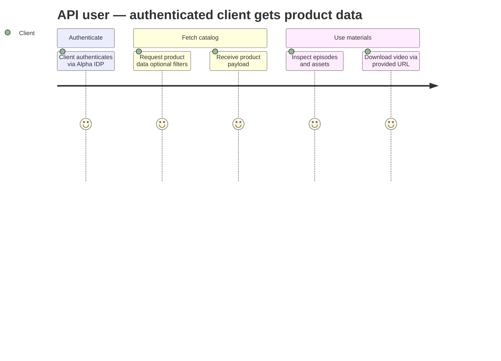
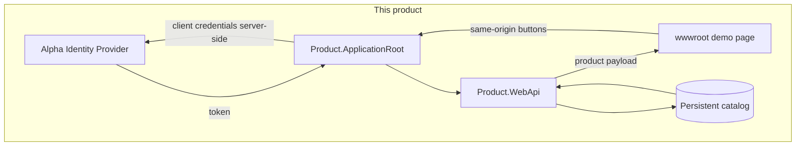
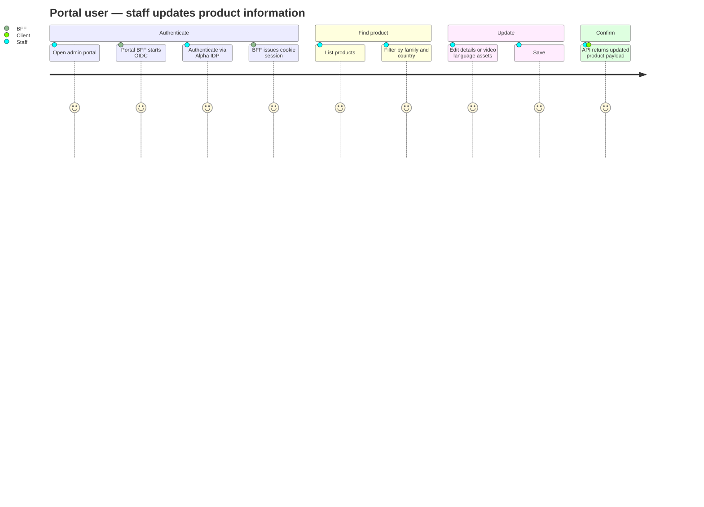
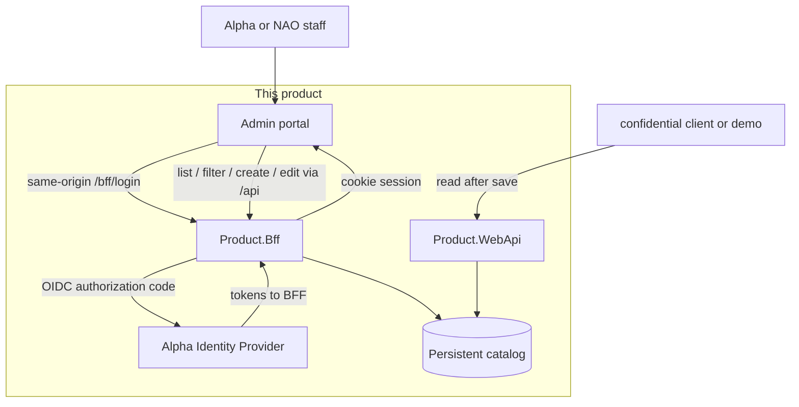
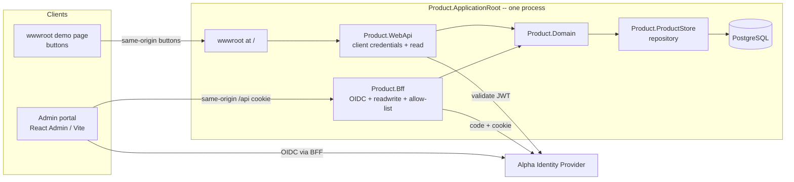
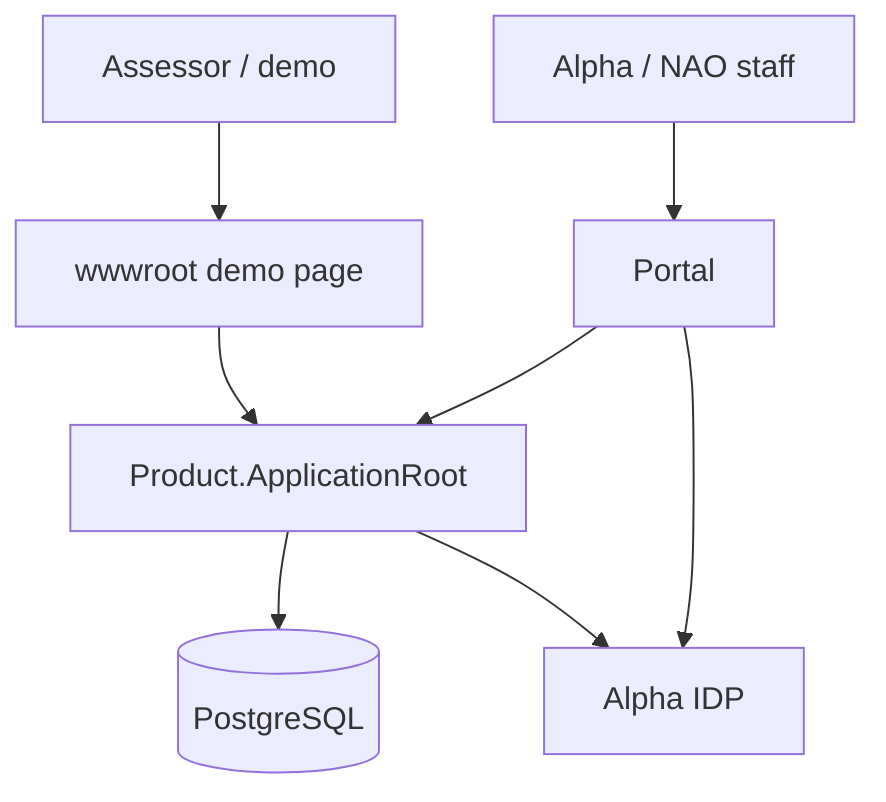
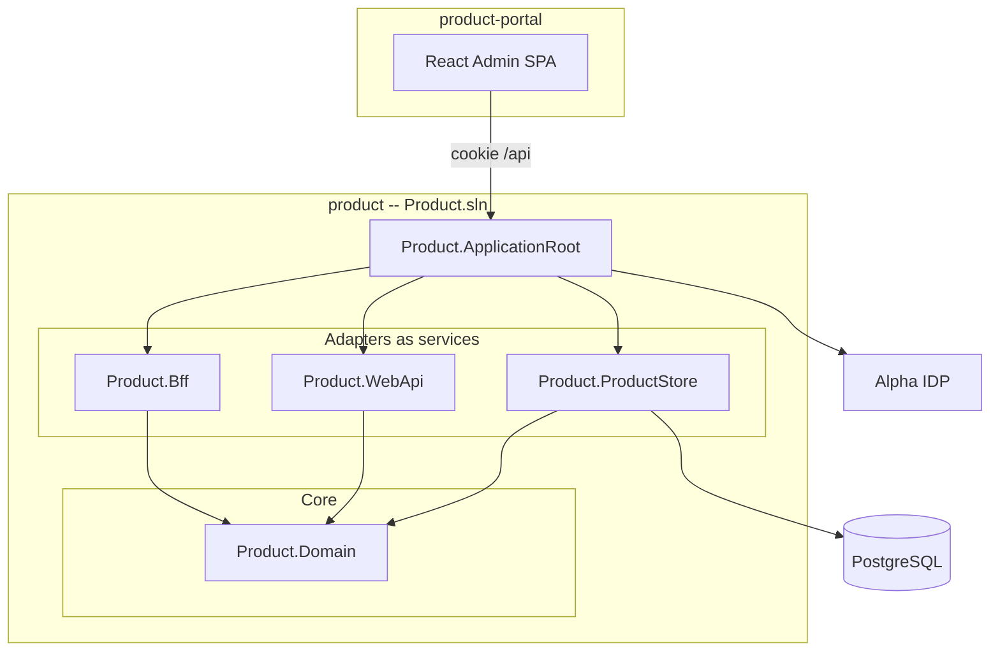

# Product and Technical Dossier

**Status:** draft — portal SPA at Vite origin `/` (no React Admin basename /admin) 2026-09-01 16:49 (UTC+2)
**Started:** 2026-08-31 20:01 (UTC+2)
**Source coverage:** Brief comprehensive dossier required coverage
**Original motivation (title only):** Whatsapp Content Distribution — not a runtime client and not a drop-in spec for this POC

---

## 1. Product and experience

I'd like to build a simplified product API that will have authenticated api endpoints to source the latest product information, as wel as an admin portal component for easy updates to the product information.

### 1.1 Purpose

The purpose of such an API would be to enable further development of applications and clients that can leverage the product data - for example our current whatsapp course registration service (specifically the content distribution implementation); the Alpha Guest App. This could also serve as the start of an overhauled, modernized Courses service for active courses, linked to our current Domain Services.

For this POC, Whatsapp Content Distribution is **motivation**, not a drop-in spec and not something we measure against. We build a **concept catalog API** (all product data we store) plus an admin portal. If the service later looks viable, a consuming app can be adapted then. The live demo of the read API is a **wwwroot page on ApplicationRoot** (buttons, same family as other Alpha BFFs and IDP), not that static site.

### Product definition

A **product** is one **content edition** of an Alpha course: a series of video episodes (plus optional training videos) with its own copy. Product meta includes at least title and description. Episode meta includes at least title, plus a **video** hosted on **Brightcove** (Vimeo remains a provider value; Brightcove is the pattern this catalog follows). Live host APIs stay out of this POC.

**Family** is a named line of courses (Alpha Film Series, Alpha Youth Series, Marriage Course, …). It is a **linked property** on a product, not a parent that owns nested editions.

**Different video and audio content = a new product.** Alpha Film Series and Alpha Film Series Africa are two products, same family. Youth, Prison, and Marriage are likewise their own products. Themes may overlap; the films are a new version. MyAlpha never used the word “contextualization”; it stored these as separate course posts related by tags. This catalog names that split explicitly and uses `product_family` for the line.

**Dub/sub is not a new product.** Language lives on the **episode video**, not as another product row. There is no catalog entry for “English AFS with French subs/dubs.” Brightcove: one video id, **language flag** when requesting it. This POC stores `provider_asset_id` + `language_code` and a `download_url` per language (no live Brightcove call). Copy (`title`, `summary`, `description`, episode titles) stays in the product’s `content_language`. Requested **language** selects **assets**, not a translated product post. RTML-style extra posts for translated copy are out of this exercise.

**Country is not a new product.** A product is **listed** in markets (`product_market`). Caller country codes (`ke`, `co`) map to `market.code` through a **country–market ACL we create as we code** (not a named schema table in this dossier). They can resolve to the same market. This is not MyAlpha’s country-site shadow-overrides of field groups (plan, hero, promo, copy) and not resolve-order global → country → language.

**Query vs row.** Course type, audience, country, and language are **optional filters** on the catalog, not a stored variant row and not a Whatsapp Content Distribution `variantKey` contract. If **language is omitted**, asset selection **falls back to the product’s `content_language`**. Audience stays many-to-many; the API can filter. More than one audience on a product is a later business decision — do not add a unique-audience constraint now.

Episode **materials** (PDFs, etc.) remain deferred; not in this POC.

### 1.2 Problem

The current content distribution solution is manifest based, with hard coded json files being the source of product information. We were unable to effectively leverage the existing MyAlpha service APIs to serve this purpose.

1. MyAlpha's service API's are very tightly coupled to the wordpress ecosystem and data design language, which means it is convoluted, hard to navigate and hard to customize for a limited purpose
2. MyAlpha's service API's are slow, queries done in sequential php and requiring multiple joins in order to source the relevant metadata for any given product.
3. The manifest system is limited to what json files we've added to the repository, so there is no easy way to add new courses to the solution.
4. The manifest system requires a lot of manual work to first source the course information, then copying it into the relevant key values.
5. The manifest system only supports hard coded URLs for video files, which means we had to find a way to externally host the specific low-res version of the videos for all supported courses. Since it is client side there is no secure way of hooking it up to the existing Vimeo and Brightcove distribution platforms in order to support additional quality profiles.

We therefore need a solution that can:

1. Store a list of products and product related metadata, including support for external video hosts, not just URLs (for example fist party player streaming of video; HLS/Dash streaming for non fist party player; download links; supporting more than one quality format).
2. The capability to return episode video in a requested **language** (asset language / Brightcove flag, not a second product).
3. The capability to list products by marketed country or region (market ACL; not a new product per country).
4. An authenticated admin portal where an Alpha staff member can edit product details and episode language assets easily.


### 1.3 Users

The primary user for the API would be the same demographic as our Whatsapp Course Registration service. The primary user for the Admin portal wil be an Alpha or NAO staff member tasked with updating product information and episode video language assets.

1. API: Course admins / Hosts and helpers
2. API: (Potentially) Course guests
3. Portal: Alpha Staff member


### 1.4 User stories


#### API user


| ID        | Story                                                                                                                                                                                                |
| --------- | ---------------------------------------------------------------------------------------------------------------------------------------------------------------------------------------------------- |
| US-API-01 | As a **course host**, I want a client to fetch **the product data we have** (optionally filtered by course type, audience, country, and language), so that I see up-to-date materials without a repository deploy. |
| US-API-02 | As a **course host**, I want that payload to include **episode list, titles, and downloadable video** in the requested language (or the product’s content language if none is specified), so that I can run the session with the right videos. |
| US-API-03 | As a **helper**, I want **Getting Started and training videos** (when the product has them), so that I can prepare before guests arrive.                                                             |
| US-API-04 | As a **host or helper**, I want results **filtered by course type, audience, market, and video language**, so that I only receive the product I registered for, with the right dub/sub.              |


#### Portal user — Alpha Staff member


| ID        | Story                                                                                                                                                                                        |
| --------- | -------------------------------------------------------------------------------------------------------------------------------------------------------------------------------------------- |
| US-POR-01 | As an **Alpha staff member**, I want to **authenticate through Alpha's existing Identity Provider via this product's portal BFF**, so that I do not keep a separate password store. |
| US-POR-02 | As an **Alpha staff member**, I want to **list products**, so that I can see what the API will serve.                                                                                        |
| US-POR-03 | As an **Alpha staff member**, I want to **filter the list by family and country/market**, so that I can find the edition I am updating.                                                      |
| US-POR-04 | As an **Alpha staff member**, I want to **create a new product** (family, audience, markets, presentation fields), so that a new content edition can ship without editing JSON in a repo.    |
| US-POR-05 | As an **Alpha staff member**, I want to **edit an existing product** (titles, intro, groups, episodes, Getting Started copy), so that corrections go live without a code change.             |
| US-POR-06 | As an **Alpha staff member**, I want to **set Brightcove id, language, and a download URL** on an episode asset, so that a dub is another language row on the same video, not a new product. |
| US-POR-07 | As an **Alpha staff member**, I want **saves to persist** and be returned by the API, so that hosts receive the edit on the next fetch.                                                      |
| US-POR-08 | As an **administrator**, I want **staff-only write** access in the portal, so that only allow-listed accounts can change catalog data.                                                |


Portal stories above are sufficient for this stage. The portal is **React Admin**; staff **authenticate** via the **portal BFF** (OIDC, `alpha.idp.readwrite`), then the BFF issues the cookie session. Portal write is gated by an **allow-list stub** of IDP accounts. **Product.WebApi** uses **client credentials** (`alpha.idp.read`). Brief “evaluator vs administrator” labels are **not a design constraint** until they become a problem.

### 1.5 Journeys

This exercise's screens are the **admin portal** and a **wwwroot demo page** on ApplicationRoot. Whatsapp Content Distribution is not in the runtime path and is not used to score the API.

#### 1.5.1 API user (confidential client / demo page)

Primary path: the **client authenticates** (client credentials against IDP, scope `alpha.idp.read`), then fetches product data (optional filters). This POC's hands-on demo is the **ApplicationRoot wwwroot** page (buttons that call this host). A later consumer is the same read, if we adapt one.







#### 1.5.2 Portal user (Alpha staff)

Primary path: staff **authenticate** through the **portal BFF** (OIDC to IDP), get a cookie session, then find and edit a product. The next authenticated WebApi fetch returns the new version.







Create-new-product is the same portal journey with "create" instead of "edit" (a new content edition, not a dub language). The read API is the API-user journey, not portal write.

### 1.6 Requirements

Best-effort baseline from sections 1.1–1.5 and 1.7. Domain model (product vs dub vs country) is locked; remaining requirement wording is still baseline. Trace IDs point at user stories where they exist.

#### Functional — product catalog API


| ID        | Requirement                                                                                                                                                                                                                                                                                    | Trace                |
| --------- | ---------------------------------------------------------------------------------------------------------------------------------------------------------------------------------------------------------------------------------------------------------------------------------------------- | -------------------- |
| FR-API-01 | An authenticated client can fetch **the product data we store** (baseline contract in 1.7). Optional filters: course type/family, audience, country/region, language. Those filters are not a stored row. Language selects episode **assets** (Brightcove flag); omitted language **falls back to product `content_language`**. Country maps through a market ACL **implemented in code**. | US-API-01, US-API-04 |
| FR-API-02 | The payload includes the catalog fields we persist: presentation, items (episodes/training), assets (including downloadable video for the requested or fallback language), tags, and markets.                                                                                                                                 | US-API-02, US-POR-06 |
| FR-API-03 | **Stretch.** When a product has Getting Started content, the payload includes that copy and any training videos. Only if time remains.                                                                                                                                                         | US-API-03            |
| FR-API-04 | Results can be filtered by course type/family, audience, market (from country), and video language. Audience remains many-to-many; the API filters. Do not require exactly one audience per product.                                                                                         | US-API-04            |
| FR-API-05 | Product data is not served anonymously. **Product.WebApi** uses **client credentials** against IDP with scope **`alpha.idp.read`** (bearer JWT). No end-user login on the read API. | Scope                |
| FR-API-06 | After a portal save, the next authenticated fetch returns the updated product payload (no repo deploy).                                                                                                                                                                                        | US-POR-07            |
| FR-API-07 | The read contract starts as **all product data in the system**. It can be tightened later if a consuming service is adopted. It is **not** the Whatsapp Content Distribution manifest JSON.                                                                                                    | Scope                |


#### Functional — admin portal


| ID        | Requirement                                                                                                                                                                                                                  | Trace        |
| --------- | ---------------------------------------------------------------------------------------------------------------------------------------------------------------------------------------------------------------------------- | ------------ |
| FR-POR-01 | Alpha/NAO staff **authenticate** through Alpha's existing Identity Provider **via Product.Bff** (OIDC, then cookie session). No separate password store.                                                                      | US-POR-01    |
| FR-POR-02 | Staff can list products.                                                                                                                                                                                                     | US-POR-02    |
| FR-POR-03 | Staff can filter that list by family and country/market. Language is edited on episode assets, not as a product row.                                                                                                         | US-POR-03    |
| FR-POR-04 | Staff can create a product (family, audience, markets, presentation fields) without editing JSON in a repo. A dub language is not a create-product action.                                                                   | US-POR-04    |
| FR-POR-05 | Staff can edit an existing product: titles, intro, groups, episodes. **Getting Started copy is stretch** (if time).                                                                                                          | US-POR-05    |
| FR-POR-06 | Staff can set Brightcove (or url) provider, `provider_asset_id`, language, and a download URL on an episode asset. Same Brightcove id may exist on more than one language row. One download URL per language this iteration. | US-POR-06    |
| FR-POR-07 | Saves persist and are what the API serves.                                                                                                                                                                                   | US-POR-07    |
| FR-POR-08 | Portal uses IDP interactive login with scope **`alpha.idp.readwrite`** through **Product.Bff**. Authorization is an **allow-list stub** of approved IDP accounts (not IDP roles). **Product.WebApi** uses **`alpha.idp.read`**. Brief evaluator/administrator labels are ignored until they become a problem. | US-POR-08    |
| FR-POR-09 | The portal is mobile-responsive.                                                                                                                                                                                             | Brief, scope |


#### Functional — exercise / delivery


| ID      | Requirement                                                                                                                                                                                                                                                   | Trace        |
| ------- | ------------------------------------------------------------------------------------------------------------------------------------------------------------------------------------------------------------------------------------------------------------- | ------------ |
| FR-X-01 | The product is fully deployed and reachable by assessors (not local-only).                                                                                                                                                                                    | Brief        |
| FR-X-02 | One end-to-end workflow: staff edits a product in the portal; an authenticated client reads the updated product payload from the API (demo page and/or confidential client).                                                                                  | Scope, brief |
| FR-X-03 | Seed a small catalog: two content editions in one family (e.g. AFS and AFS Africa); two caller countries via market ACL; two languages on assets of one product (same Brightcove ids). Do not import production catalog or production media URLs/credentials. | Scope        |


#### Non-functional


| ID     | Requirement                                                                                                                                                                                                                                                 |
| ------ | ----------------------------------------------------------------------------------------------------------------------------------------------------------------------------------------------------------------------------------------------------------- |
| NFR-01 | Persistent storage for products, items, and language-specific assets. Language variants are **asset rows**, not a stored JSON blob per query.                                                                                                               |
| NFR-02 | Consume Alpha Identity Provider **as-is** (dev discovery: [https://dev.auth.alpha.org/.well-known/openid-configuration](https://dev.auth.alpha.org/.well-known/openid-configuration)). Existing scopes **`alpha.idp.read`** and **`alpha.idp.readwrite`**. No IDP code, policy, roles, or user-store work. Demo **OAuth clients** may be registered; details in **env after scaffold**. |
| NFR-03 | Dev/non-production auth only for this build.                                                                                                                                                                                                                |
| NFR-04 | Start from a **baseline contract of all catalog data we store**. Do not copy the Whatsapp Content Distribution manifest JSON. Tighten the contract later only if a consumer is adopted.                                                                      |
| NFR-05 | Secrets and production credentials stay out of source control and archives.                                                                                                                                                                                 |
| NFR-06 | This service stores **product catalog data only**. No user profiles or PII. Identity data stays with IDP.                                                                                                                                                   |
| NFR-07 | Each C# module has unit tests; inbound adapters and ApplicationRoot have acceptance tests. Portal has unit tests (Vitest).                                                                                                                                  |
| NFR-08 | Observability: **Application Insights** when `ApplicationInsights__ConnectionString` is set; otherwise **stdout**. Custom events for alertable outcomes. No tokens or IDP profile payloads in logs. |


#### Stretch (if time)

Getting Started content (payload, portal edit, training videos) is not required to call the exercise done. Do it only if the core catalog API and portal ship first.

#### Explicitly not requirements for this iteration

- Rebuilding Whatsapp Content Distribution, the WhatsApp worker, MyAlpha, Guest App, or Domain Services.
- Measuring this POC against the Whatsapp Content Distribution site or matching its manifest JSON.
- A new product row per dub/sub language; RTML extra posts for translated copy; MyAlpha country-site field-group overrides.
- Live Vimeo/Brightcove/HLS/DASH/first-party player integrations (fields may exist; no live host work). Caption/VTT management.
- OpenAPI/Swagger on Product.WebApi: UI at `/swagger` on ApplicationRoot. Paste a client-credentials bearer (scope `alpha.idp.read`). `products.http` remains the integrated test.


### 1.7 Scope

**Baseline freeze for this exercise.** The product is a small, authenticated **product catalog API** plus an **admin portal**, plus a **wwwroot demo page** on ApplicationRoot. Whatsapp Content Distribution **motivated** the problem (static JSON, no portal). This POC is **not** a drop-in for that manifest and is **not** scored against that site. If the catalog looks viable later, a consuming service can be adapted then.

Later ambitions (Guest App, Domain Services, a modernized Courses platform, first-party playback) are acknowledged in purpose/problem and belong in section 4, not in this build.

#### In scope

- Persistent storage of **products** (content editions), **items**, and **language-specific assets**. Optional query filters (family/code, audience, country, language) are **not** a stored variant row.
- Authenticated **read API** that returns a **baseline contract: all product data we have in the system** (see 1.7 contract). Adjustable later; not the Whatsapp Content Distribution JSON shape.
- Filters: **course type / family**, **audience** (many-to-many; API filters; do not force one audience), **country / region** (market ACL **written as we code**), **video language** (asset `language_code`; **if omitted, fall back to product `content_language`**).
- Authenticated **admin portal**: **React Admin** (TypeScript, React, Vite). Full CRUD on catalog models. The SPA does not hold client secrets; staff **authenticate** through this product's **portal BFF** (OIDC to IDP, cookie session).
- Live deploy and one end-to-end workflow: staff edits a product, then the API returns the updated payload. Demo of the read API: **ApplicationRoot `wwwroot`** at the **root** of the host — a **single page with buttons**, same family as other Alpha BFF / IDP demos. Portal SPA is served on a separate path (e.g. `/admin`) so `/` stays the demo page.
- A **video asset** record that is more than a bare URL: Brightcove (or url) provider, `provider_asset_id`, `language_code`, and a `download_url`. Same Brightcove id may appear on more than one language row. Seed **one download URL per language** per episode (360p-style placeholder). Do not call live video platforms.
- Seed a **small representative catalog**: two products in one family (global AFS and AFS Africa); two caller countries mapping through an ACL (they may share a market); two languages on assets of one product (same Brightcove ids). Do not import a full production catalog. Do not copy production media URLs or credentials.
- Authenticate against **Alpha's existing Identity Provider** as standard OAuth/OIDC. **No IDP service/policy/role work.** Demo **clients may be registered**; **client details go in env files after scaffold**. WebApi: **client credentials**, scope **`alpha.idp.read`**. Portal BFF: interactive OIDC, scope **`alpha.idp.readwrite`**, plus an **allow-list stub** of approved IDP accounts (not IDP roles).
- **Stack:** One C# process (**Product.ApplicationRoot**) that plugs **BFF** and **WebApi** as adapter services, plus **Product.ProductStore** (Postgres repository). Portal: React Admin + TypeScript + Vite (`product-portal`). Two repositories in the target operating model; this exercise colocates both under `Solution/`.


#### Stretch (if time)

**Getting Started** content (`gettingStarted` copy, training videos, portal edit of that block) is a stretch goal. Core success does not depend on it. Include only if time remains after the catalog API, episode/video fields, and portal CRUD.

#### Authentication intent (no IDP service work)

Use Alpha's self-hosted Duende IdentityService. Authentication policies already live there. This build only **consumes** the provider as a standard OAuth/OIDC client. **No changes to the IDP service** (policies, users, themes, roles, claims, extra scopes, server configuration).

- **Discovery (dev only):** [https://dev.auth.alpha.org/.well-known/openid-configuration](https://dev.auth.alpha.org/.well-known/openid-configuration)
- Do **not** use production-scoped auth services for this build.
- IDP **clients are data**. The candidate **will register demo clients** and put ids/secrets in **env files once the project is scaffolded**. Do not put secrets in source control.
- IDP has role-based-access **scaffolding only**: no roles assigned, **no role claims** on tokens. Do not add roles in IDP. **Scopes (existing):** **`alpha.idp.read`** on Product.WebApi (client credentials, bearer); **`alpha.idp.readwrite`** on Product.Bff (interactive OIDC). Portal **authorization stub:** configured allow-list of approved IDP accounts (subject or email). Not stored in the product database. Replace with IDP roles later without changing the catalog schema.
- **Portal BFF (this project):** confidential OIDC client, cookie session (Duende BFF pattern, same family as MyAlpha BFF), scope `alpha.idp.readwrite`. React Admin calls same-origin CRUD under `/api`. No client secret in the SPA. Staff-only: an IDP user not on the allow-list does not get portal access.
- **Product.WebApi:** bearer JWT from **client credentials**, scope `alpha.idp.read`. No end-user identity on read. The **wwwroot demo page** must not embed that secret in JavaScript; buttons call **this host** (same-origin / server-side token), same idea as other Alpha BFF and IDP demo pages.


#### Deferred to later in the build

Optional: Swagger UI client-credentials click-to-token if IDP CORS allows it. Bearer paste at `/swagger` already works.

#### Baseline API contract (all product data we have)

The read API returns the catalog we persist, not a Whatsapp Content Distribution variant map. A payload can include:

- **Family** and **product** (code, titles, summary, description, `content_language`, presentation fields we store)
- **Tags** (including audience; many-to-many)
- **Markets** the product is listed in
- **Items** (episodes and training: code, sequence, title, optional summary/grouping)
- **Assets** on those items and the product (provider, `provider_asset_id`, `language_code`, `download_url`, capabilities, duration/size if stored)

Query parameters **filter** that graph. They do not invent a second stored shape. **Language omitted → use product `content_language`.** Country → market via ACL **coded during implementation**. Contract fields can change later if a consumer is adopted.

Nested CMS, page builders, or a separate "courses / sessions / materials" domain remain out.

#### Out of scope (explicit)

- Rebuilding or hosting Whatsapp Content Distribution, adding its BFF, or treating its manifest JSON as this API's contract
- The WhatsApp registration worker, payload minting, or `?d=` contract
- MyAlpha / WordPress APIs, Domain Services, Guest App, or a full Courses rewrite
- MyAlpha country-site shadow-overrides of field groups (plan, hero, promo, copy) and resolve-order global → country → language
- RTML `language_relationships` / extra product posts for translated copy; a product row per dub or sub
- Live Vimeo, Brightcove, HLS/DASH packaging, first-party players, or signed-URL refresh jobs (fields may exist; integrations may not). Caption/VTT files.
- POEditor / chrome i18n dictionaries as a service
- Mixpanel or other analytics
- Materials/PDFs and other non-video resources as a required feature (asset `role` may exist; do not build a materials library)
- Multi-NAO tenancy, CMS workflow, translation memory, or content approval pipelines
- Changes to the IDP **service**: policies, users, themes, roles, claims, extra scopes, or server configuration. Registering **demo clients** (env after scaffold) is allowed.


#### Exercise success (this 12-hour POC)

A staff member can maintain a handful of **products** (and episode language assets) in the portal; an authenticated client (wwwroot demo and/or confidential client) can fetch the latest **product payload** without a repo deploy. That is the whole product for cutoff. Success is **not** “Whatsapp Content Distribution still works against this API.”

### 1.8 Key experience decisions

Baseline architecture decisions. Domain model locked. ApplicationRoot / scopes / tests / privacy in §3 proposed with the structure.


| ID        | Decision                                                                                                                                                                                                                                                                                                                                    | Reasoning                                                                                                                                                |
| --------- | ------------------------------------------------------------------------------------------------------------------------------------------------------------------------------------------------------------------------------------------------------------------------------------------------------------------------------------------- | -------------------------------------------------------------------------------------------------------------------------------------------------------- |
| D-ARCH-01 | The product API is **C#**, same family as Alpha's Identity Provider.                                                                                                                                                                                                                                                                        | If this becomes a product, the API team already knows the approach. Fits the current stack.                                                              |
| D-ARCH-02 | The admin **portal** is **React Admin** on **TypeScript + React + Vite**. Full CRUD on catalog models.                                                                                                                                                                                                                                      | Faster staff UI than a bespoke CRUD app. SPA has no client secret; it talks to the portal BFF.                                                           |
| D-ARCH-03 | **API and portal are two repositories** (target operating model). This exercise colocates them under `Solution/` as `product` (`Product.sln`) and `product-portal`.                                                                                                                                                                         | API team owns C#; UI team owns the SPA.                                                                                                                  |
| D-ARCH-04 | Persistence is **PostgreSQL**, accessed through **Product.ProductStore** (a repository).                                                                                                                                                                                                                                                    | Store is a driven adapter in role, not in project name.                                                                                                  |
| D-ARCH-05 | C# follows **ports and adapters** with **Product.ApplicationRoot** as the only process entrypoint. BFF and WebApi are adapter services. Domain owns entities and `IProductRepository`. **No Product.Application project.** No `Driven.*` / `Driver.*` names. | Catalog rules live in Domain; adapters stay thin. A separate use-case project did not fit. |
| D-ARCH-06 | This POC does **no work outside this project**. Whatsapp Content Distribution is **not** a runtime client here. **Portal BFF is in this project.** Read-API demo is **ApplicationRoot wwwroot** (buttons, no client secret in the page). | We are not scoring a drop-in. A later consumer would need its own confidential BFF if it is a static site. |
| D-ARCH-07 | Demo OAuth **clients are registered for this POC**; ids/secrets in **env after scaffold**. Existing scopes **`alpha.idp.read`** / **`alpha.idp.readwrite`**. Implementation is **AI-assisted** to stay inside 12 hours. | No IDP service/role/policy work. Do not add roles or scopes in IDP. |
| D-ARCH-08 | **One process.** ApplicationRoot maps Product.Bff and Product.WebApi on the same host. Both call Domain / ProductStore in-process. | No second host, no HTTP hop between adapters. |
| D-ARCH-09 | **WebApi** = client credentials + **`alpha.idp.read`**. **Portal** = interactive OIDC + **`alpha.idp.readwrite`**, then an **allow-list stub** of approved IDP accounts. | Scopes already exist. Roles do not. Stub is replaceable when IDP roles ship. |
| D-DOM-01  | A **product** is one content edition. Different video and audio content (e.g. AFS vs AFS Africa; Youth / Prison / Marriage) is a **new product**, same family when it is the same line. **Dub/sub is not a new product**: Brightcove language flag on the episode asset (`provider_asset_id` + `language_code`). Copy stays on the product. | Locked 2026-09-01. MyAlpha used separate graphs for course vs country override vs RTML copy; we do not rebuild those graphs.                             |
| D-DOM-02  | **Country** is market listing + an ACL **created in code**. Caller `ke`/`co` → `market.code`. Optional filters are not a stored variant row. Language omitted → product `content_language`. Audience stays many-to-many. | Avoids storing one variant row per language/country. ACL is not a dossier table. |


---


## 2. System design

Baseline. Data model in §2.7. **C# / portal structure in §2.1-2.4 is proposed for review.** Deploy still to refine.

### 2.1 Explanations

Three existing or neighbouring systems sit around this product:

- **Alpha Identity Provider (IDP)** -- self-hosted Duende IdentityService, **C#**. We consume it; we do not change the service. Demo clients may be registered; details in env after scaffold. No role claims today.
- **Whatsapp Content Distribution** -- **JavaScript / Astro** static client. **Motivation only** for this POC. Not rebuilt, not integrated, not used to score the API.
- **MyAlpha BFF** -- cookie/OIDC BFF pattern and **wwwroot demo page** reference. We do not rebuild or modify it.
- **Core Services (Profile)** -- **ApplicationRoot** convention: the entrypoint plugs adapters as services. We do not rebuild or modify it, and we do not copy double nesting or reverse-proxy to inner hosts.
- **This product** -- one C# process (**Product.ApplicationRoot**) plus a **React Admin** portal (TypeScript, Vite) plus a **wwwroot demo page**.

The application core is the system of record for **product** data only (no user records). **Product.Bff** authenticates staff (OIDC cookie, `alpha.idp.readwrite`, allow-list stub) and exposes **CRUD** for React Admin. **Product.WebApi** exposes **read-only** product payloads (client credentials, `alpha.idp.read`). Both are adapter **services on ApplicationRoot**, same process. The portal SPA and the wwwroot demo never hold a client secret.

**Ports and adapters (Core Services ApplicationRoot, without Driven/Driver project names):**

- **Product.ApplicationRoot** is the only process. `Program` calls `AddProductModules`: **ProductStore** first (so Bff and WebApi can inject `IProductRepository`), then Bff and WebApi. Adapters are plugged as services on the same host.
- **Product.Domain** owns entities and the **IProductRepository** port. There is **no Product.Application** (use-case) project.
- **Product.ProductStore** is the Postgres **repository**. `ProductStoreAdapter` registers **scoped** `ProductDbContext`, **scoped** `DbContextOptions`, and **scoped** `IProductRepository` / `ProductRepository` (not singleton).
- **Product.Bff** and **Product.WebApi** are inbound adapters. They map HTTP on the **same** host (path prefixes). They do not own catalog rules and do not HTTP-call each other.

Taken from Core Services Profile: ApplicationRoot as composition root; WebApi as an adapter service. **Not** taken: `Profile/src` double nest, inner Kestrel per adapter, reverse proxy, `Driven.*` / `Driver.*` names, Service Bus, cron.

Taken from MyAlpha BFF: cookie + OIDC, `/bff/login`, `__Host-` cookie, `AsBffApiEndpoint`. **Not** taken: WordPress/MySQL, HMAC, token-exchange, YARP to remote Alpha APIs.

**Two repos (intent):** `product` (C#, `Product.sln`) and `product-portal` (SPA). This exercise colocates both under `Solution/`.

**Auth:** WebApi = client-credentials bearer + `alpha.idp.read`. Portal = interactive OIDC + `alpha.idp.readwrite` + allow-list stub. Demo clients in env after scaffold. Brief evaluator/administrator labels are not a design constraint this POC.

### 2.2 Architecture diagram




### 2.3 Context diagram




The **wwwroot demo page** and the **portal** are the runtime clients in this exercise. Whatsapp Content Distribution, MyAlpha, Domain Services, Guest App, and the WhatsApp worker stay outside the boundary. MyAlpha BFF and Core Services are **references**, not runtime dependencies.

### 2.4 Component diagram and solution structure

Proposed layout for review. One C# process. Names as below (no `Driven.*`).

```text
Solution/
  product/                             C# (API team) -- Product.sln
    src/
      Product.ApplicationRoot/         entrypoint: one process, plugs adapters; wwwroot demo at /
      Product.Domain/                  entities + IProductRepository port
      Product.Bff/                     inbound adapter: Duende BFF, OIDC, CRUD
      Product.WebApi/                  inbound adapter: client credentials, read catalog
      Product.ProductStore/            Postgres repository (implements IProductRepository)
    tests/
      Product.Domain.Tests/            unit
      Product.ProductStore.Tests/      unit (+ store acceptance against Postgres)
      Product.Bff.Tests/               unit
      Product.Bff.Acceptance.Tests/    portal BFF HTTP
      Product.WebApi.Tests/            unit
      Product.WebApi.Acceptance.Tests/ client-credentials read HTTP
      Product.ApplicationRoot.Tests/   composition unit
      Product.ApplicationRoot.Acceptance.Tests/  staff-edit then API-read (FR-X-02)
  product-portal/                      Vite + React Admin (Vitest unit; E2E via ApplicationRoot acceptance if time)
```

**Product.ApplicationRoot**

- `Program` / host builder: `AddProductModules` (ProductStore, then Bff, then WebApi). Register **Application Insights** when the connection string is set; always keep **stdout** logging.
- One Kestrel listener. BFF and WebApi contribute route groups, they do not start their own web hosts.
- **`wwwroot`** at the **root of the host** (`/`): a **single static demo page with buttons** to exercise the read API (same family as other Alpha BFF / IDP demos). No client secret in that page; same-origin / server-side token.
- Production: also serve the Vite `dist` (portal) as static files on a **path other than `/`** (e.g. `/admin`) so the cookie site matches. Dev: Vite proxy to ApplicationRoot for the portal.

**Product.Bff**

- Cookie + OIDC to IDP, scope **`alpha.idp.readwrite`**, `UseBff`, `MapBffManagementEndpoints`. Named cookie/OIDC schemes (`ProductBffCookie` / `ProductBffOidc`) so they cannot satisfy `/product` bearer routes.
- After authentication, **allow-list stub** (configured IDP account ids / emails). Empty list denies everyone. Not a user table.
- CRUD under `/api` (React Admin / `ra-data-simple-rest` or equivalent). GET handlers are reused from Product.WebApi; POST/PUT/DELETE live in `Product.Bff/Endpoints`. `AsBffApiEndpoint` (CSRF `X-CSRF: 1`).
- Calls Domain / ProductStore in-process. OIDC client id/secret in env (`Bff:ClientId`); omitted ClientId skips OIDC so tests can start.

**Product.WebApi**

- Inbound adapter: `ProductWebApiAdapter` registers module services and maps `/product` on ApplicationRoot (same host; no inner Kestrel). `AddProductWebApi` / `UseProductWebApi` / `MapProductWebApi` are the composition-root façade.
- JWT bearer from **client credentials**, scope **`alpha.idp.read`**.
- Swagger UI at **`/swagger`**: two documents — Product API (bearer) and Portal BFF (`/api`, cookie + `X-CSRF: 1`). `products.http` is the integrated test for the read API.
- Read routes return the **baseline product contract** (all product data we store, optional filters). No create/update/delete.

**Product.ProductStore**

- Driven adapter: `ProductStoreAdapter` registers **scoped** `ProductDbContext`, **scoped** `DbContextOptions`, and **scoped** `IProductRepository`. `AddProductStore` is the composition-root façade. ApplicationRoot calls it via `AddProductModules` before Bff and WebApi.

**product-portal**

- Scaffolded: Vite `react-ts` + React Admin + Vitest, **pnpm** only. Resources for the BFF models: lists show related **names** (not FK ids); create/edit pick related rows in a native `<dialog>`. Dev SPA is the **Vite origin root** (`/`) — no `basename="/admin"` (that left the router matching `/` against `/admin` and rendering nothing). Sign-in is a full-page `/bff/login`: Product.Bff OIDC to the IDP, callback `/signin-oidc`, cookie session. After login, a spinner stays up while `checkAuth` probes the allow-list (`GET /api/languages`). Allow-listed accounts open **products**. A 403 shows an Unauthorized page with Log out (session is not cleared automatically). Logout navigates to `/bff/logout?sid=…` from `bff:logout_url`. Custom same-origin `dataProvider` (cookie + `X-CSRF: 1`). HTTPS Vite + `X-Forwarded-Proto: https`. Authorize sends `countryCode` (`Bff:CountryCode`; Development `za`, production `global`). ApplicationRoot `wwwroot` stays on the API host only.




### 2.5 Deployment diagram

To be refined. Intent: **one** C# deployable (**Product.ApplicationRoot**) plus the portal SPA (served by that host under a path such as `/admin`) and **wwwroot demo at `/`**. Live, reachable environment for assessors. Hosting vendor and pipelines later.

### 2.6 Database schemas

PostgreSQL database **`product_service`** (local). Apply `Solution/Data/product_schema.sql`. Validate with `Solution/Data/product_schema_smoketest.sql`. Local example graph: `Solution/Data/seed_product_data_example.sql`. Country–market ACL is **code**, not a table.

### 2.7 Data model

The data model's primary purpose is a **product catalog**: store editions, items, and assets, and return that graph on the read API. Whatsapp Content Distribution **motivated** the problem; we do **not** project its manifest JSON. We take **intent** from MyAlpha (separate course posts for different films; language on the video; country as a listing) without rebuilding WordPress graphs (country field-group overrides, RTML copy posts, `(id, blog_id, language)` tuples).

**Resolve (query, not a table):** optional filters — `courseType` → family and/or `product.code`; `audience` → tag (many-to-many; API filters); `country` → `market` via an ACL **we write as we code**; `language` → `asset.language_code`. **If language is omitted, fall back to product `content_language`.**

#### Schema Design

```mermaid
erDiagram
    product_family {
        uuid    id       PK
        text    code     UK
        text    name
        text    summary
        integer sequence
    }

    product {
        uuid    id               PK
        uuid    family_id        FK
        text    code             UK
        text    title
        text    summary
        text    description
        text    content_language FK
    }

    product_item {
        uuid    id          PK
        uuid    product_id  FK
        text    kind        "episode training"
        text    code        "unique per product"
        integer sequence
        text    title
        text    summary
        text    grouping
        boolean is_optional
    }

    asset {
        uuid    id                PK
        uuid    product_id        FK
        uuid    item_id           FK "NULL = product-level"
        text    role
        text    kind
        text    language_code     FK
        text    title
        text    group_code
        text    provider
        text    provider_asset_id
        text    stream_url
        text    download_url
        boolean allow_stream
        boolean allow_download
        integer duration_seconds
        bigint  file_size_bytes
    }

    asset_market {
        uuid asset_id     PK
        text market_code  PK
    }

    product_market {
        uuid product_id   PK
        text market_code  PK
        date launched_on
    }

    tag {
        uuid    id        PK
        text    category
        text    code
        text    name
        boolean is_public
        integer sequence
    }

    product_tag {
        uuid product_id PK
        uuid tag_id     PK
    }

    language {
        text    code   PK "BCP-47"
        boolean is_active
    }

    market {
        text code   PK "za ssa lat gb"
        text kind   "country region"
        text name
    }

    product_family  ||--o{ product         : editions
    product         ||--o{ product_item    : items
    product         ||--o{ asset           : all assets
    product_item    ||--o{ asset           : item assets
    product         ||--o{ product_tag     : tagged
    tag             ||--o{ product_tag     : tags
    product         ||--o{ product_market  : listed in
    market          ||--o{ product_market  : hosts
    asset           ||--o{ asset_market    : marketed to
    market          ||--o{ asset_market    : targets
    language        ||--o{ asset           : asset language
    language        ||--o{ product         : copy language
```


#### Data Dictionary

**Tables**


| Table            | Definition                                                                                      | Why included                                                                                                                                                                                                                               |
| ---------------- | ----------------------------------------------------------------------------------------------- | ------------------------------------------------------------------------------------------------------------------------------------------------------------------------------------------------------------------------------------------ |
| `language`       | Closed list of BCP-47 content-language codes Alpha uses.                                        | FK target for product copy and assets. Prevents `en` / `EN` / `en-gb` drift. Not a locale directory.                                                                                                                                       |
| `market`         | A place a product can be listed: a country **or** a region, one code (`za`, `ssa`).             | Staff have one country/region slot. Caller country codes (e.g. `ke`, `co`) are not stored as markets 1:1; a **country–market ACL implemented in code** maps caller country → `market.code`. Exact market codes on launch/asset rows are intentional. |
| `product_family` | The course **line** shared by content editions (Alpha Film Series, Youth, Marriage Course).     | Groups sibling products. Africa editions typically use a distinct `product.code`.                                                                                         |
| `product`        | One content edition: copy in one language, its own items and assets. Different films = new row. | Catalogue unit. AFS and AFS Africa are siblings. A French dub is **not** a third product.                                                                                                                                                  |
| `tag`            | One vocabulary of suitability answers (audience, context, format).                              | Flattened MyAlpha `coursequestion` answers. Audience lives here. `category` is normalised (lowercase); portal first ships a small hard-coded set.                                                                               |
| `product_tag`    | Link: this product has this tag.                                                                | Extra tags (context, format). **Many-to-many, including audience.** The API can filter by audience. More than one audience is a later business decision; do not add a unique-audience constraint. No `default_audience` column. |
| `product_market` | Link: this product is **listed** in this market. Absence = not listed there.                    | Not a country copy override. No launched/pilot/withheld status this round.                                                                                                                                                                 |
| `product_item`   | An ordered session in a product: an episode or a training session.                              | Same shape, one table. Items are **not shared**: two courses using the same video still get two `product_item` rows.                                                                                                                       |
| `asset`          | One watchable, readable, or downloadable file (video, PDF, image, …), with hosting metadata.    | Dub/sub of an episode is another **asset row** (same `provider_asset_id`, different `language_code`), not another product. Read API includes `download_url`.                                                                                  |
| `asset_market`   | Optional restriction: this asset is marketed only in these markets.                             | Exact match. A global course can still have a market-specific asset that must be filtered out. **No rows = everywhere.**                                                                                                                   |


**Columns**


| Table            | Column              | Definition                                                                                                        | Why included                                                                                                |
| ---------------- | ------------------- | ----------------------------------------------------------------------------------------------------------------- | ----------------------------------------------------------------------------------------------------------- |
| `language`       | `code`              | BCP-47 tag (`en`, `es`, `zh-Hant`). PK.                                                                           | Identity and FK.                                                                                            |
| `language`       | `is_active`         | Whether Alpha currently offers this as a content language.                                                        | Withdraw a language without deleting FKs.                                                                   |
| `market`         | `code`              | Stable id (`za`, `gb`, `ssa`, `lat`). PK. One namespace.                                                          | Filter and launch FK. Caller country codes map in via ACL, not identity.                                    |
| `market`         | `kind`              | `country` or `region`.                                                                                            | Groups a picker. Not a second table.                                                                        |
| `market`         | `name`              | Display label (“South Africa”, “Sub-Saharan Africa”).                                                             | Alpha’s name for the patch, not UN M.49.                                                                    |
| `product_family` | `id`                | UUID primary key.                                                                                                 | Internal identity.                                                                                          |
| `product_family` | `code`              | Stable slug of the line (`alpha-film-series`). Unique.                                                            | Family identity. Africa editions use `product.code`.                                                        |
| `product_family` | `name`              | Human name of the family.                                                                                         | Portal / later card, distinct from an edition’s title.                                                      |
| `product_family` | `summary`           | Short family blurb.                                                                                               | Optional; cards usually use `product.summary`.                                                              |
| `product_family` | `sequence`          | Sort order among families.                                                                                        | Replaces MyAlpha `menu_order` at family level.                                                              |
| `product`        | `id`                | UUID primary key.                                                                                                 | New identity. Not a WordPress post id.                                                                      |
| `product`        | `family_id`         | FK to `product_family`.                                                                                           | Which course **line** this edition belongs to.                                                              |
| `product`        | `code`              | Stable slug (`alpha-film-series`, `alpha-film-series-africa`). Unique.                                            | Human key when the edition is not the same as the family slug.                                              |
| `product`        | `title`             | Edition title in `content_language`.                                                                              | Portal and API.                                                                                             |
| `product`        | `summary`           | Short copy for lists/cards.                                                                                       | Portal and API.                                                                                             |
| `product`        | `description`       | Long copy.                                                                                                        | MyAlpha detail `content`.                                                                                   |
| `product`        | `content_language`  | FK to `language`. Language of title/summary/description/episode titles.                                           | One product = one language of **text**. Video language is on `asset`. No RTML copy post.                    |
| `tag`            | `id`                | UUID primary key.                                                                                                 | Internal identity.                                                                                          |
| `tag`            | `category`          | Bucket (`audience`, `context`, `format`). Normalised lowercase.                                                   | Distinguishes audience from other answers. UI restricts to a hard-coded list first.                         |
| `tag`            | `code`              | Stable key (`adults`, `prison`, `film`). Unique with category.                                                    | Filter key; later recommend answers.                                                                        |
| `tag`            | `name`              | Staff-facing label.                                                                                               | Portal.                                                                                                     |
| `tag`            | `is_public`         | If false, never shown in public listings.                                                                         | Youth-safeguarding. Unused by this POC’s demo page; kept for a later public listing.                        |
| `tag`            | `sequence`          | Sort order.                                                                                                       | Lists and a later wizard.                                                                                   |
| `product_tag`    | `product_id`        | FK to `product`. Part of PK.                                                                                      | Junction.                                                                                                   |
| `product_tag`    | `tag_id`            | FK to `tag`. Part of PK.                                                                                          | Junction. Audience is many-to-many; API filters.                                                            |
| `product_market` | `product_id`        | FK to `product`. Part of PK.                                                                                      | Which edition.                                                                                              |
| `product_market` | `market_code`       | FK to `market`. Part of PK.                                                                                       | Where it is listed. Exact match (`ssa` ≠ `za`). Not a shadow-override of copy.                              |
| `product_market` | `launched_on`       | Date listed in that market.                                                                                       | Optional. Not a course schedule. No launch-status enum this round.                                          |
| `product_item`   | `id`                | UUID primary key.                                                                                                 | Internal identity.                                                                                          |
| `product_item`   | `product_id`        | FK to `product`.                                                                                                  | Items are not shared across products. Same video as two episodes ⇒ two rows.                                |
| `product_item`   | `kind`              | `episode` or `training`.                                                                                          | One table for two session types.                                                                            |
| `product_item`   | `code`              | Stable id (`ep-01`). Unique per product.                                                                          | Session identity.                                                                                           |
| `product_item`   | `sequence`          | Order within kind. Unique per product+kind.                                                                       | Episode order.                                                                                              |
| `product_item`   | `title`             | Session title.                                                                                                    | Same language as the product.                                                                               |
| `product_item`   | `summary`           | Optional short copy for the session.                                                                              | Detail; optional.                                                                                           |
| `product_item`   | `grouping`          | Free-text label (`weekend`, `module-2`).                                                                          | Hint for API/UI grouping. Not a group entity. Presentation/contract, not schema.                            |
| `product_item`   | `is_optional`       | If true, omitted from completeness counts.                                                                        | Partial-dub reporting.                                                                                      |
| `asset`          | `id`                | UUID primary key.                                                                                                 | Internal identity.                                                                                          |
| `asset`          | `product_id`        | FK to `product`. Always set.                                                                                      | Denormalised so “all assets for a product” is one query. Composite FK with `item_id` keeps it honest.       |
| `asset`          | `item_id`           | FK to `product_item`, or NULL.                                                                                    | NULL = product-level (hero, promo, host guide). Set = hangs off an episode/training.                        |
| `asset`          | `role`              | What it is for: `main_video`, `supporting`, `material`, `thumbnail`, `promo_video`, `promo_banner`, `hero_image`. | One table instead of material/promo entities. Seed must include `main_video`; other roles may be empty.     |
| `asset`          | `kind`              | File class: `video`, `document`, `image`, `audio`, `link`.                                                        | Constrains provider rules.                                                                                  |
| `asset`          | `language_code`     | FK to `language`, or NULL.                                                                                        | Brightcove **language flag**. Requested language selects this; omitted → product `content_language`. NULL = language-neutral (logo). |
| `asset`          | `title`             | Label for portal/detail.                                                                                          | Display; not the product title.                                                                             |
| `asset`          | `group_code`        | Shared key for language variants of one logical **material** file.                                                | EN/FR discussion guide without a join table. Video dubs share `provider_asset_id` instead.                  |
| `asset`          | `provider`          | Where it lives: `brightcove`, `vimeo`, or `url`.                                                                  | Brightcove is the pattern for this catalog. Vimeo remains a value. Video+`url` CHECK is still a later call. |
| `asset`          | `provider_asset_id` | Id on Brightcove (or Vimeo).                                                                                      | Same id across dubbed languages. Production would request that id with a language flag.                     |
| `asset`          | `stream_url`        | Playback URL when the provider is `url` (or an explicit stream).                                                  | First-party/HLS later; not required this POC.                                                               |
| `asset`          | `download_url`      | File URL for download.                                                                                            | One URL per **language** this iteration (POC does not call Brightcove).                                     |
| `asset`          | `allow_stream`      | Whether it may be played in a player.                                                                             | Capability. Not entitlement.                                                                                |
| `asset`          | `allow_download`    | Whether it may be downloaded.                                                                                     | Capability. *Who* may is out of this model.                                                                 |
| `asset`          | `duration_seconds`  | Length, if timed.                                                                                                 | Store now; no staff edit or provider lookup this build.                                                     |
| `asset`          | `file_size_bytes`   | Size on disk, if known.                                                                                           | Same as duration.                                                                                           |
| `asset_market`   | `asset_id`          | FK to `asset`. Part of PK.                                                                                        | Which asset.                                                                                                |
| `asset_market`   | `market_code`       | FK to `market`. Part of PK.                                                                                       | Where this asset may be marketed. Omit all rows ⇒ everywhere. Exact match intended.                         |


### 2.8 Data flows

Primary flows: staff (allow-listed) **authenticate** via **Product.Bff** OIDC (`alpha.idp.readwrite`); BFF cookie session; React Admin CRUD → `/api` → Domain → ProductStore. Confidential client (or ApplicationRoot wwwroot demo using a **server-side** token) calls **Product.WebApi** with **client-credentials** bearer (`alpha.idp.read`); Domain returns the **baseline product contract**. Country ACL (in code) and language fallback (product `content_language`) live in Domain. See journeys in 1.5.

### 2.9 APIs and contracts

**Product.WebApi** (prefix **`/product`**, read-only). `ProductWebApiAdapter` orchestrates DI, Swagger, and route mapping on ApplicationRoot. Auth is client credentials, **`alpha.idp.read`**, named JWT bearer scheme. Handlers live in `Product.WebApi/Endpoints`; `Routes.MapApi` uses OpenAPI `.Produces` / `.WithTags` chaining and `RequireAuthorization` on the group. Swagger UI is **`/swagger`** (anonymous page; dropdown for **Product API** bearer and **Portal BFF** `/api` with cookie + `X-CSRF: 1`). Portal CRUD remains **Product.Bff** `/api` (`ProductBffAdapter`, `Endpoints/Routes.cs`). GET reuses Product.WebApi handlers; writes are BFF-local. Cookie + `alpha.idp.readwrite` + allow-list; `X-CSRF: 1`. Demo buttons hit ApplicationRoot (same-origin). All live on **Product.ApplicationRoot**.

| Method | Path | Notes |
| --- | --- | --- |
| GET | `/product/languages` | Lookup list |
| GET | `/product/languages/{code}` | Lookup |
| GET | `/product/markets` | Lookup list |
| GET | `/product/markets/{code}` | Lookup |
| GET | `/product/families` | Lookup list |
| GET | `/product/families/{id}` | Lookup |
| GET | `/product/tags` | Lookup list |
| GET | `/product/tags/{id}` | Lookup |
| GET | `/product/products` | Baseline product payloads. Query: `courseType`, `audience`, `country`, `language`. Unknown `country` → 400. `country` maps via Domain country–market ACL. Omitted `language` → product `content_language` for assets. |
| GET | `/product/products/{id}` | Full payload; optional `language` |
| GET | `/product/products/code/{code}` | Full payload by product code; optional `language` |
| GET | `/product/items` | Optional `productId` |
| GET | `/product/items/{id}` | Item row |
| GET | `/product/assets` | Optional `productId`, `itemId` |
| GET | `/product/assets/{id}` | Asset row |
| GET | `/product/product-tags` | Optional `productId` |
| GET | `/product/product-markets` | Optional `productId` |
| GET | `/product/asset-markets` | Optional `assetId` |

Product GET payloads include family, tags, markets, items (with language-selected assets), and product-level assets. Write methods are not mapped on WebApi.

### 2.10 Integrations, dependencies, and system connections


| System                                     | Role        | Work in this exercise                                                                                                                           |
| ------------------------------------------ | ----------- | ----------------------------------------------------------------------------------------------------------------------------------------------- |
| Alpha Identity Provider (C# / Duende)      | AuthN       | Consume the service. Existing scopes `alpha.idp.read` / `alpha.idp.readwrite`. No role claims. Demo **clients registered**; details in **env after scaffold**. |
| PostgreSQL                                 | Persistence | Owned by the C# application.                                                                                                                    |
| Whatsapp Content Distribution (JS / Astro) | Motivation  | Not rebuilt, not integrated, not used to score this POC.                                                                                        |
| ApplicationRoot wwwroot demo               | Read demo   | Single page with buttons at `/`. Same-origin / server-side token. No client secret in the page.                                                 |
| Admin portal (React Admin / Vite / TS)     | Staff UI    | Separate repo. Same-origin CRUD against **Product.Bff**. Authenticate via BFF OIDC, not a SPA secret. Served under a path such as `/admin`.     |
| MyAlpha BFF                                | Reference   | Cookie/OIDC BFF pattern and wwwroot demo family. Not a runtime dependency. Not modified.                                                        |
| Core Services (Profile)                    | Reference   | ApplicationRoot composition. Not a runtime dependency. Not modified. Do not copy inner-host reverse proxy.                                      |
| Application Insights                       | Observability | Standard Alpha approach. Connection string from env. Fallback: **stdout** if unset. Logs + custom events for alerts. |


No MyAlpha, WordPress, live Vimeo, live Brightcove, or Mixpanel integrations in this iteration. Brightcove is modeled as `provider` + `provider_asset_id` + `language_code` only. Application Insights is telemetry only (optional connection string).

### 2.11 Authentication and access

See section 1.7 **Authentication intent** and §3.3. IDP service is consume-only (demo clients in env). **Product.WebApi:** client credentials, **`alpha.idp.read`**. **Product.Bff:** interactive OIDC, **`alpha.idp.readwrite`**, then allow-list stub. No user rows in Postgres. The wwwroot demo must not hold the WebApi client secret in the browser.

### 2.12 Infrastructure and environments


| Piece                   | Baseline                                                                    |
| ----------------------- | --------------------------------------------------------------------------- |
| Product.ApplicationRoot | One C# process; plugs Bff + WebApi + ProductStore; **wwwroot demo at `/`**; portal SPA on a path such as `/admin` |
| Product.Bff             | Adapter service: Duende BFF, OIDC cookie, CRUD `/api`                       |
| Product.WebApi          | Adapter service: JWT bearer, read-only catalog routes                       |
| Product.ProductStore    | Postgres repository                                                         |
| Portal                  | React Admin, TypeScript, Vite; source in `product-portal`                   |
| Database                | PostgreSQL                                                                  |
| Auth                    | IDP **dev**; scopes `alpha.idp.read` / `alpha.idp.readwrite`; portal allow-list stub; demo client ids in env |
| Observability           | Application Insights when configured; otherwise stdout                      |
| Exercise layout         | Colocate `product` and `product-portal` under `Solution/`                   |


Hosting vendor and pipelines: to be refined.

---


## 3. Quality and security

### 3.1 Testing

Each C# module has a paired test project. **Unit** tests sit on every module. **Acceptance** tests sit on the HTTP adapters and ApplicationRoot (the surfaces a caller can hit).

| Project | Kind | What it proves |
| --- | --- | --- |
| `Product.Domain.Tests` | Unit | Entities, resolve query (course type / audience / market ACL / asset language), no HTTP. |
| `Product.ProductStore.Tests` | Unit + store acceptance | Repository against Postgres (or a test database). Persistence of products/items/assets. |
| `Product.Bff.Tests` | Unit | Allow-list stub, CSRF/BFF wiring helpers, mapping to Domain. |
| `Product.Bff.Acceptance.Tests` | Acceptance | Interactive cookie session, `alpha.idp.readwrite`, allow-listed account can CRUD; non-listed IDP user is denied. |
| `Product.WebApi.Tests` | Unit | Return baseline product contract; reject missing scope. |
| `Product.WebApi.Acceptance.Tests` | Acceptance | Client-credentials bearer with `alpha.idp.read` can read; write methods are absent/forbidden; wrong/missing token fails. |
| `Product.ApplicationRoot.Tests` | Unit | Adapters are plugged; one host. |
| `Product.ApplicationRoot.Acceptance.Tests` | Acceptance | **FR-X-02:** allow-listed staff save via BFF; confidential client (or demo host) reads the updated payload from WebApi. |
| `product-portal` (Vitest) | Unit | React Admin resources/forms. Browser E2E only if time (otherwise covered by Bff/ApplicationRoot acceptance). |

Exercise success does not require full coverage. Priority: Domain resolve + ProductStore persistence + WebApi read acceptance + one portal-save-then-API-read path.

### 3.2 Observability

Use Alpha's usual **Application Insights** integration (same family as Core Services / MyAlpha BFF). Scaffold it in **Product.ApplicationRoot**.

**Configuration** (connection string from environment, not source control):

```text
ApplicationInsights__ConnectionString=<instrumentation connection string>
```

If the connection string is **missing or empty**, log to **stdout** only (local/dev fallback). When it is set, log to Application Insights **and** stdout.

**What we emit**

| Kind | Use |
| --- | --- |
| Request / dependency traces | Default AI ASP.NET telemetry |
| Logs (`ILogger`) | Request path, product id/code, outcome. **Never** access tokens, ID tokens, or IDP profile payloads |
| Exceptions | Unhandled and handled failures we care about |
| Custom events | Conditions we may **alert** on (below) |

**Custom events (alert candidates)**

| Event name | When |
| --- | --- |
| `portal.allow_list.denied` | Authenticated IDP user is not on the staff allow-list |
| `auth.failed` | Missing/invalid token or cookie on WebApi or BFF |
| `catalog.resolve.missed` | Resolve query matched no product/assets |
| `product.saved` | Staff persisted a catalog change (telemetry; alert only if volume is wrong) |

Alert rules themselves live in Application Insights / Azure Monitor later; this POC **emits** the events and logs. No Mixpanel. No user-analytics store.

### 3.3 Security model

**Authentication (IDP, consume-only)**

| Surface | Grant | Scope | Token |
| --- | --- | --- | --- |
| Product.WebApi | Client credentials | `alpha.idp.read` | Bearer JWT |
| Product.Bff / portal | Authorization code (OIDC) via Duende BFF | `alpha.idp.readwrite` | Server-side cookie; SPA has no client secret |

Scopes already exist on IDP. This build does not add scopes or roles. **Demo OAuth clients may be registered**; ids/secrets live in **env after scaffold**, not in source control.

**Authorization (this product, not IDP roles)**

IDP does not return role claims. After a successful portal login, an **authentication/authorization stub** checks the IDP account (subject or email) against a **configured allow-list**. Only listed staff get portal CRUD. The list is configuration (environment), not a table in Postgres.

WebApi authorization is **scope**: `alpha.idp.read` on a client-credentials token. No user allow-list on the read API.

**Brief evaluator vs administrator labels**

Treat as **semantics to ignore** until they become a problem. This POC: confidential client for the read API; allow-listed staff for the portal.

**Data in this service:** product catalog. Tokens are validated and discarded; they are not stored as user records.

### 3.4 Threat and risk analysis

| ID | Threat | Impact | Mitigation this iteration | Residual |
| --- | --- | --- | --- | --- |
| T-01 | wwwroot demo or SPA given a WebApi client secret | Secret extracted from the JS bundle | Demo page and portal **do not** hold client credentials. Buttons call this host (same-origin / server-side token). Confidential client stays on the server or in env for tests. | High if someone later wires the secret into static JS. |
| T-02 | Any IDP user with `readwrite` reaches portal CRUD | Catalog defacement | Allow-list stub after OIDC. Unlisted accounts denied. | List is only as good as config hygiene; not real RBAC. |
| T-03 | Allow-list committed to git | Staff emails/subjects in the repo | Config/env, not source. NFR-05. | Mis-config in a shared env file. |
| T-04 | Bearer token used on BFF cookie routes (or the reverse) | Privilege mix-up | Separate route groups; WebApi requires client-credentials + `read`; BFF requires cookie + `readwrite` + allow-list. | Implementation must keep schemes from leaking across prefixes. |
| T-05 | CSRF on cookie CRUD | Write as the staff user | Duende BFF anti-forgery (`x-csrf` / `AsBffApiEndpoint`), `__Host-` cookie. | Depends on correct BFF setup. |
| T-06 | IDP account takeover of an allow-listed staff user | Full catalog write | IDP owns passwords/MFA (out of this service). Staff-only list limits who can even be a portal user. | Same as any staff SSO. |
| T-07 | Catalog download URLs leaked | Video files fetched without our API | Seed uses placeholder URLs. API still requires `read`. We do not add a public anonymous catalog. | Media hosting is outside this POC. |
| T-08 | Allow-list stub mistaken for production RBAC | Over-trust | Documented in 3.6; replace with IDP roles later; no user table to migrate. | Process risk. |
| T-09 | Logs store tokens or IDP profile claims | PII in logs | 3.2: do not log tokens or profile payloads. | Operator error. |

### 3.5 Data and privacy decisions

- **Stored here:** product catalog only (families, products, items, assets, markets, tags, languages). **No user table, no host/guest PII, no token store.**
- **Identity:** IDP remains the system of record for people. Access tokens and ID tokens are used to authenticate requests and are not persisted as user data in this service. They fall under **existing IDP data-privacy policies**.
- **Portal:** interactive login is **staff-only** (allow-list). That limits which IDP accounts can present a user token to this app.
- **WebApi:** **client credentials** -- no end-user identity on read. Confidential client, not a browser.
- **Allow-list:** account identifiers in configuration. Treat as operational config, not catalog data.

### 3.6 Known limitations

- Portal authZ is an **allow-list stub**, not IDP roles. Full RBAC waits on IDP.
- Whatsapp Content Distribution is not a consumer in this POC. A later static consumer would need its own confidential BFF.
- React Admin is dense on small phones (FR-POR-09 is best-effort).
- Getting Started remains stretch.
- Alert rules in Azure Monitor are not designed in this POC; we emit events/logs so they can be wired later.
- Country–market ACL is implemented in code when we build; not specified as a table here.

## 4. Future and production


### 4.1 Roadmap


### 4.2 Product and technical vision


### 4.3 Remaining work


### 4.4 Time, effort, people, and roles


### 4.5 Costs


### 4.6 Dependencies


### 4.7 Assumptions needed to take the product to production

